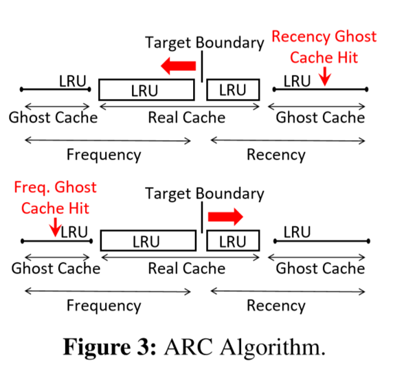
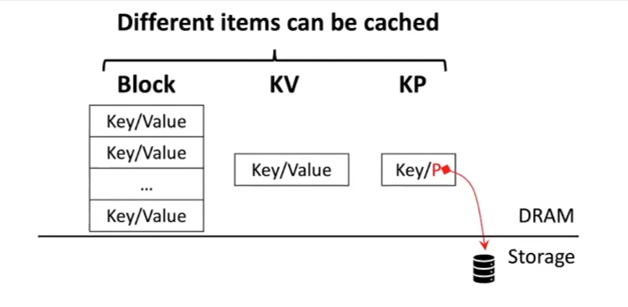
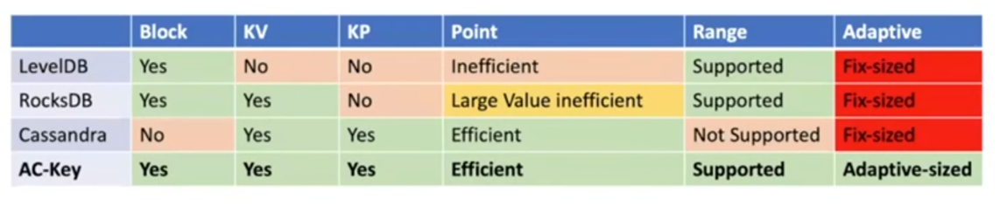
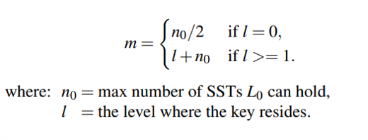
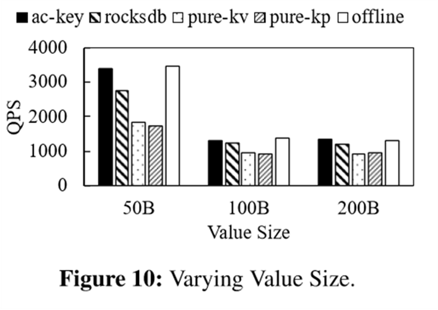

# AC-Key: Adaptive Caching for LSM-based Key-Value Stores

> USENIX ATC'20
> Fenggang Wu, Ming-Hong Yang, Baoquan Zhang, and David H.C. Du, University of Minnesota
> https://www.usenix.org/conference/atc20/presentation/wu-fenggang

## key word

- 使用cache来提升基于LSM Tree的KV store读性能
- ARC算法
- cache benefit and cache cost

## background

### LSM Tree

特点：写友好，读不友好

LSM Tree基本原理：
总体来说，LSM Tree分为两部分，一部分存在于DRAM——MemTable，一部分存在于Storage——SST files。KV（Key-Value）对存储在一个一个的Data Block中。当DRAM中的MemTable满了之后，会通过flush操作将数据刷到Storage中。Storage中的SSTable以树状形式排列，flush操作会首先将数据刷到L0的一个SST中。当L0满后通过compaction操作将数据merge到L1中，以此类推。同时，每个SSTable中存放的不只是data block，还包括BF block——布隆过滤器，以及Index Block——当前SSTable 存放的Key的索引。以及Storage中的每一个level（除L0外）会有一个特殊的文件包含了该层所有SSTable存储的Key范围。

这就导致LSM Tree在查找数据时需要读出多个块，即经过多次storage I/O，才能查找出结果，开销较大。

### ARC 

一种使用ghost cache动态调整cache大小的算法

ARC基本原理：
首先，Cache中维护了4个LRU，2个以Frequency为策略, 2个以Recency为策略。图中的方框表示Real Cache，里面存放了真实的数据，横线表示Ghost cache，其size相对较小，存放的是从Real cache中被剔除的数据的元数据，例如page number等。当Recency侧的ghost cache命中时，该数据应被放回到Recency real cache中，因此Recency real cache的size需要增大，动态的boundary需要向Frequency侧移动；同理，当Frequency侧的ghost cache命中时boundary向Recency侧移动，从而达到cache size的动态自适应。

### LSM -- read

基于LSM Tree的KV Store的读请求有两种类型：
- point lookup 点查找：单个KV对
- range query 范围查找：范围内多个KV对

## Challenge

### Cache item type

1. 首先，Cache中可以存放的item类型有三种：
- block（basic I/O unit），例如data block，BF block，index block
- KV，即Key Value对
- KP，即Key Pointer对，pointer为指向storage的指针，实际数据需要经过一次storage I/O才能获取。

2. 这三种类型的cache有各自的特点：
- block能存放多个有序的KV对，非常适合范围查找。
- KV cache存放了一个一个的KV对，不需要额外的I/O即可读出数据，适合点查找，但当Value的size较大时空间利用率较低，因此适用于value size较小的情况。
- KP cache将Value转变为指针，尽管需要一次I/O，但cache的空间利用率大，适用于点查找中value size较大的情况。
- 同时，相比KP cache来说，KV cache应对热点问题更加有效。

3. 目前存在的问题：

- 目前较为成熟的几个产品例如LevelDB, RocksDB, Cassandra，都只实现了三种cache类型中的一种或两种，不能够很好地兼容点查找和范围查找，并且无法动态调整大小。

4. 因此，本文提出，**Key Challenge is:**
- **adjust the size of different types of caches according to dynamic workloads**

### cache efficiency

另外，基于LSM Tree的特点，使用cache来提高读性能还需要考虑**cache benefit与cache cost之间的平衡**：
- cache benefit：一次cache hit所能节省的storage I/O
  - Key存在的level越深，能够节省的storage I/O越多
- cache cost：Cache entry占用的cache space

## Design

### caching efficiency factor
为了权衡cache benefit与cache cost，本文设计了一个**caching efficiency factor：**

定义为benefit与cost的比值，即 节省的I/O与所占的cache space之间的比值。

根据这个factor E，本文改进了：
- LRU → E-LRU: 选择最近最少使用的**a**个条目，从中剔除**E**值最小的条目
- ARC → E-ARC：根据E来确定动态boundary移动的距离

#### Saved storage I/O--b

1. b的计算方式：

- 对于block cache来说，因为一个block是最基本的I/O单元，因此若发现下一个要读取的block已经在cache中了，则该次I/O被节省，因此$b=1$
- 对于KV cache来说，因为可以直接在cache中匹配所要查找的key，若命中了，则在storage中查找该key的所有I/O都可以被节省，此时b被定义为一个m相关的函数，m为查找该key要经过的SSTable的数量。
- 对于KP cache来说，cache命中时仍要比KV cache多一次I/O，因此可节省的I/O要比KV cache少1。

2. m的计算方式：

- 假设Storage中$L_0$的的SSTable数量为$n_0$，则：
  - 当要查找的key存在于$L_0$时，需要一个一个遍历$L_0$中的SSTable直到找到key，因此平均下来$m=n_0/2$
  - 当要查找的key存在于其它level时，需要首先遍历$L_0$中的所有SSTable，即$n_0$次I/O，再往下查找每个level中存放有key范围的特殊文件，因此是$l$次I/O，所以$m=l+n_0$

3. $f(m)$
    $f(m)$取决于KV store的实现，不过在通常情况下：

    - $f(m) = m+2$

    因为查找一个KV对首先要读出m个BF block(布隆过滤器)来找到key所在的SSTable，再读出1个index block来找到key所在的data block，最后再将data block读出来找到对应的key value。

### AC-Key Caching components

1. 总体框架：
- AC Key将block、KV以及KP整合进cache中，并使用E-ARC算法动态调整大小。

2. Block cache
- 包含data block、 BF block以及index block

3. KV cache and KP cache
- 若有新的key需要加入cache，则首先加入到KP cache中，此key被定义为warm key。
- 当KP cache中的key命中时，该key升级为hot key，经过1次storage I/O取出value后将KV对保存到KV cache中。
- 保存到KV cache中的hot key无法回退为warm key，因其pointer信息已经丢失。

### Flush & Compaction Handling

由于LSM Tree的flush操作和compaction操作会影响到cache的有效性，所以还需要做相应的处理。
（处理read请求时，KV store首先会在MemTable中查找，未查找到的才会在cache中查找）

1. flush handling
- 在进行flush时，根据MemTable中的内容在KV cache和KP cache中匹配对应的key并更新。
- 由于flush时只会在storage中产生新的块，不会影响到旧的块，因此block cache无需更新。

2. compaction handling
- compaction会影响KP cache和block cache，但不会影响KV cache。
- 对于KP cache来说，只需要将对应的指针更新为compaction后的新地址。
- 对于block cache来说，需要移除失效的block，并以key范围与之有最大重叠的新block代替。

### HAC: Hierarchical Adaptive Caching 

1. 分层的自适应cache总体架构：
- 上层分为point cache和block cache，对其应用E-ARC算法动态调整大小。
- 下层point cache内部分为KV cache和KP cache，对其应用E-ARC算法动态调整大小。

2. boundary移动规则：
- 当KV ghost cache或KP ghost cache命中时，都会导致point cache的size增大，而只有当增大的size达到了一个block的size时，point cache与block cache之间的boundary才会真正向block cache侧移动。
- 当block ghost cache命中时，会导致point cache的size减小，此时KV cache以及KP cache按照他们size的比例对应减小。

3. boundary移动距离：
    $d=kE=k{b/s}$

## Evaluation

### AC Key的自适应过程展示

1. offline介绍：

    offline是指，在无法动态调整三种cache的size大小的情况下，手动设置KP cache所占比例以及block cache所占的比例进行测试，选择测试结果最优的配置作为最终的固定配置进行实验。

- 横坐标0-1为range query，可以看到此时全为block cache
- 横坐标1-3为point cache，block cache急剧减少至0，KV cache和KP cache不断上升并动态调整至平衡。
- 可以看到AC-Key与offline相比，读性能相近甚至更优。

### 性能对比

- rocksdb相当于pure block

1. varying cache size

2. varying value size

3. varying hot key ration and range query ratio

## 总结

AC-Key是一种使用cache来提升基于LSM Tree的KV store读性能的设计，在cache中整合了block cache、KV cache以及KP cache来适应不同类型的读请求，并且运用了一种改进的ARC算法动态调整cache大小来提高cache的空间利用率。
