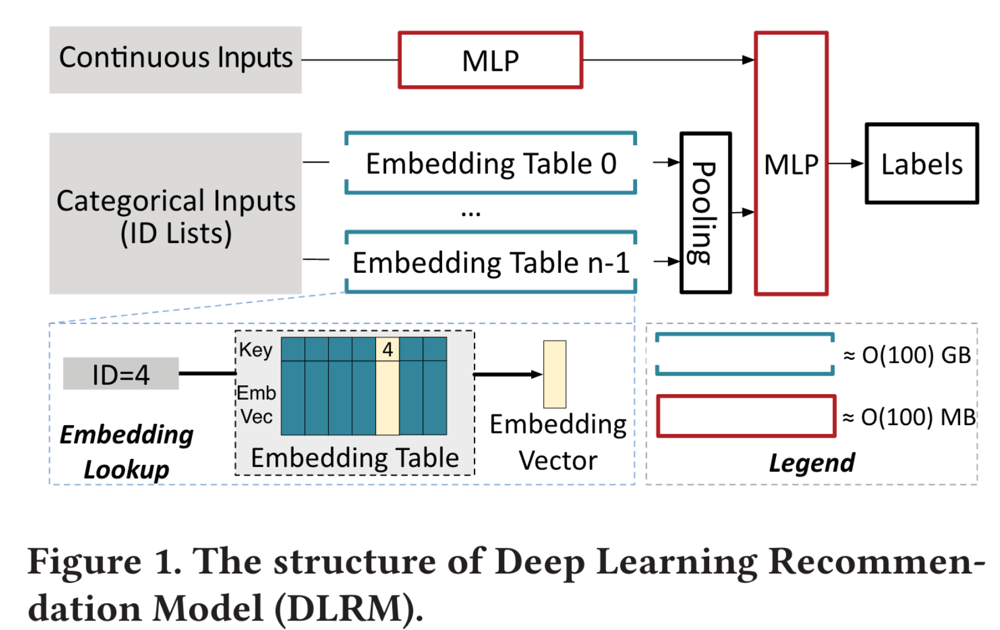
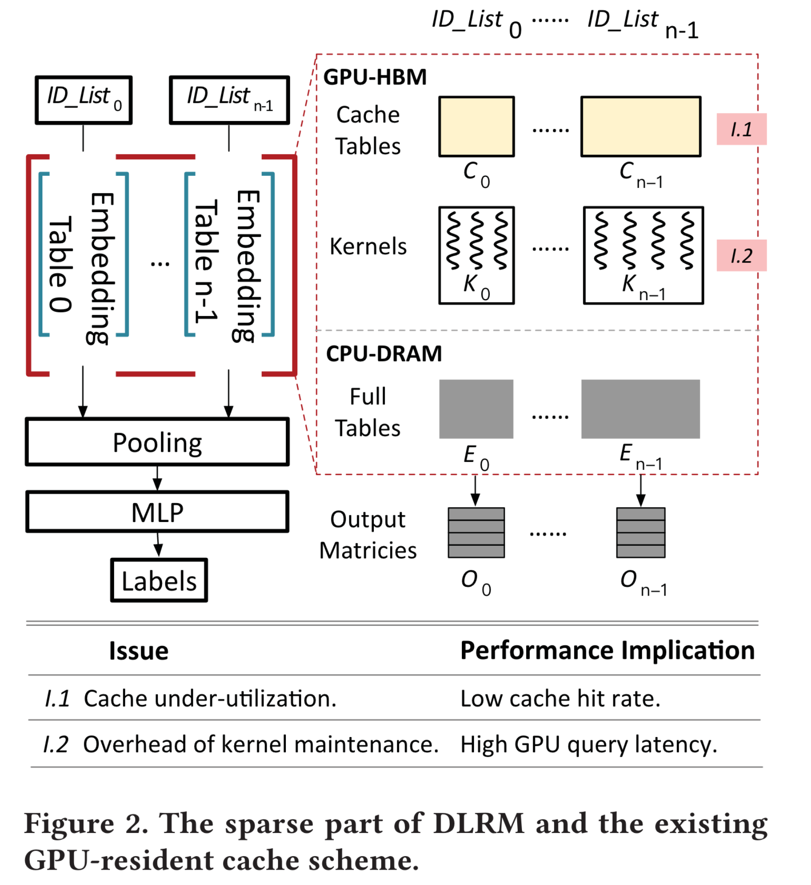
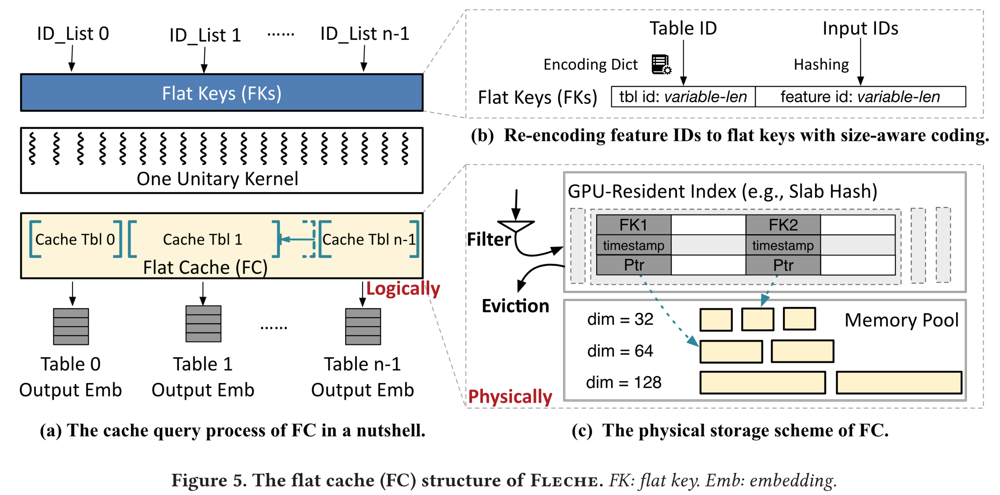

# 一、背景

- DLRM由 稀疏的嵌入层 和密集的全连接层 组成  
- 由嵌入表的不规则访问和稀疏访问导致的CPU端的DRAM带宽稀缺已经成为DLRM的主要性能瓶颈
- 现有缓存方案（static per-table cache structure）没有很好地利用GPU端cache。该缓存方案为每个嵌入表维护一个固定大小的cache table，以防止表重新分区期间发生大量数据移动。
- 对NVIDIA HugeCTR-inference进行了测试，主要问题来源：
    - 缓存利用率不足：static per-table structure带来的缺陷
    - 内核维护开销：small cache-query内核过多，导致70%的缓存查询时间花费在kernel execution以外的任务上。

**针对缓存利用率不足的问题：**
采用flat cache：与其对每个嵌入表的cache table进行分区，flat cache对所有嵌入表重新编码，使其能够共享一个全局缓存。

**针对内核维护开销过大的问题：**
由于大多数的内核启动请求是针对同样的function，只是输入的参数不同，因此文章采用了self-identified kernel fusion：将小型内核调用合并为单一调用，并让内核中的每个线程识别它最初应该服务的内核调用。 这种方法大大减少了内核查询数，减轻了内核维护开销，同时保留了多缓存表查询的语义。

**优化缓存查询流程：**
1. 将hit embedding与 indexing FC解耦 -> 使得GPU-HBM与CPU DRAM可以高度并行。即：当发生miss时，可以直接从CPU DRAM加载embedding，无需等待 复制hit embedding的完成
    
2. 采用统一索引技术，将CPU-DRAM层的部分索引卸载到GPU -> 进一步减少了cache miss的开销，且能够利用GPU的涡轮增加提升查找性能。
    

# 二、DLRM详解

- 类别input(通常是ID list) 是one-hot 或者multi-hot的高维特征
    
- 嵌入表类似于哈希表，对于每个类别的特征维护一个嵌入表
    
- 嵌入表查询类似于哈希表查询，其中，key是input ID，value 是d-维 embedding vector
    
- 嵌入表查询完成之后，将得到的vector通过池化操作压缩成密集向量
    
- 最后所有池化向量与原始输入的密集向量一起输入MLP
    

**存在的问题：**

- 嵌入层的随机查找会导致大量的 cache miss
    
- 多个线程同时访问多个嵌入表会耗尽DRAM带宽
    

**直观的解决方案：**

- 将hot embedding缓存在GPU
    

# 三、现有缓存机制详解

- CPU内存中保存的是embedding full table，GPU内存中保存的是cache table(比full table更小)
    
- 当查询缓存时，现有的机制会启动一个kernel（每个cache table对应1个kernel），kernel会先将所有cache hit的embedding加载到输出矩阵，然后kernel执行完毕，随后CPU从GPU那获得cache miss 的ID list，查询embedding table，再将所需要的embedding加载到输出矩阵。在这个过程中，n个kernel可以放到n个cudaStream中进行并发。
    
- HugeCTR为每个embedding table静态设置了相同size的cache table。然而，由于热度不同，这种静态缓存只能缓存下每个embedding table内部的热点，而无法将全局的embedding 热点很好地缓存。
    
- 所谓内核维护时间，可以分为：CPU启动、上下文初始化、CPU同步、CPU-GPU通信。缓存表数量越多，启动kernel数越多，内核维护所需时间更长。
    

# 四、设计

## 4.1 flat cache

1. cache table 结构
    
    - 采用KV分离的形式，内存池存储来自不同缓存表的所有value，GPU侧的索引维护从flat key到内存池 location的映射。
        
    - 最小化元数据信息：不存储size相关信息，因为key是id，value是embedding table，通过value也能知道size；存储了时间戳充当版本号，能够进行并发读写控制，不需要额外的元数据。
        
2. flat key格式
    
    - 所有的cache table实际上公用一个全局cache
        
    - 简单采用固定长度的table id与固定长度feature id拼接的形式，容易产生大量哈希冲突，因为key的数量不同。例如，city的数量很少但是user的数量很多，所以user表会有大量哈希冲突但是city表就很空
        
    - 因此文章采用了size-aware encoding：将较短的id分配给较大的table。根据embedding table的大小，计算出可以容纳所有feature所需的bit之后，剩余的bit全部用来存储table id。
        
3. 缓存替换和驱逐
    
    - 基于概率的过滤策略：每个embedding有1/p的概率会放入cache，因此读取次数大于p的特征一定会放入缓存，这样就能够让缓存尽可能多地保存热数据。
        
    - 缓存驱逐时尽可能驱逐cold embedding。epoch-based space reclamation：声明某个embedding被驱逐时并没有实际从cache中移除，而是等到所有线程都不需要读取这个embedding才真正回收空间。
        

## 4.2 self-identified kernel fusion

1. 初始化阶段：CPU初始化1个数组用于存放原始n个kernel的参数，并计算一个scan数据，计算前i个kernel的线程数总和，然后启动1个kernel，这个kernel具有原本n个kernel线程数总和的线程。
    
2. 识别阶段：在这个阶段，每个GPU线程需要确定原本n个内核的时候自己对应哪个位置，可以通过scan数组来确定。由于所有的线程共享scan和args数组，所以它们可以缓存在GPU的SM共享内存中，加速重复访问。
    
3. 执行阶段：读取到参数之后就可以像原来那样执行查询了。由此，原来的多kernel启动减少到了单kernel启动。
    

## 4.3 优化cache查询流程

1. 将copy和indexing解耦：当有2个wrap同时访问同一个KV对时，wrap1会将该表项上锁，进行index、从GPU全局内存copy，然后解锁，wrap2必须等待此过程。从全局内存copy是耗时的过程，将index与copy解耦之后，只需要启动1个额外的kernel去进行copy，此后1个kernel执行index，另一个kernel执行copy。而copy kenel无需担心线程安全问题，因为有epoch-based space reclamation。
    
2. 绕过DRAM层索引：将DRAM层的索引信息加入统一索引层，在GPU就可以获取到DRAM location信息，GPU的查找速度也比CPU更快，但是这样会占用额外的GPU内存空间，本来可以用于缓存embedding，因此这两者之间需要权衡。
    

# 五、实现

采用cudaMemcpy是很慢的，大概6-7 us。使用GDRCopy库，可以把HBM暴露给CPU，基于GPUDirect RDMA技术使用CPU驱动的拷贝方式，将small copy加速到0.1us

# 六、不足

1. 只考虑单机情况，多机情况下DRAM也只是一个缓存层，因此指向DRAM的指针可能会失效
    
2. 只考虑了单GPU情况。多GPU情况下缓存空间会更大，且模型并行消除了GPU之间的冗余。
    

注意：persistent kernel虽然可以通过轮询减少内核维护开销，但持久地占用了SM资源会导致后续的MLP层性能大幅降低。

注意：NLP和GNN中也有embedding table。NLP的嵌入表比较小，可以完全缓存在GPU中。GNN的嵌入表则与DLRM类似。

baseline ： HugeCTR from NVIDIA