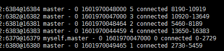
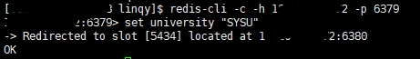
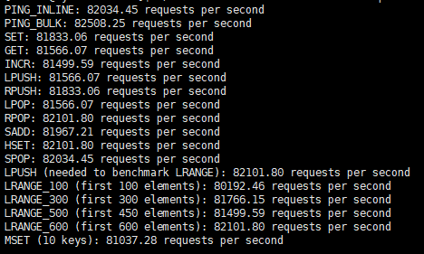
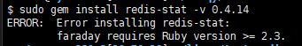

## Redis环境配置记录

> 记录在centos上安装redis的过程

1. 下载Redis软件包
   ` wget http://download.redis.io/releases/redis-6.0.0.tar.gz `
   选择最新版redis压缩包进行下载

2. 解压并安装
   ` tar xvf redis-6.0.0.tar.gz `
   ` cd redis-6.0.0 `
   ` make `
   ` sudo make install PREFIX=/usr/local/redis `

3. 创建redis命令软链接
   ` sudo ln -s /usr/local/redis/bin/redis-server /usr/bin/redis-server `
   上述命令为redis-server创建了软链接，这样在任何目录下都能启动redis服务器，对客户端、benchmark等也可以进行同样的软链接操作。

4. 安装libatomic.so.l
   启动redis服务器时遇到error：
   ` redis-server: error while loading shared libraries: libatomic.so.1: cannot open shared object file: No such file or directory `
   安装libatomic即可解决：
   ` sudo yum -y install libatomic `

5. 启动redis集群
   为多个server修改配置文件以配置不同的端口、开启集群模式等，
   然后运行多个server，每个server启动命令如下：
   ` redis-server ./redis-6.0.0/conf/redis-6379.conf `

6. 后台查看server运行状态
   ` ps -fu username ` 可以查看用户名下运行的所有进程

   

7. 启动后客户端连接服务器
   ` redis-cli -h xxx -p xxx `
   ` -h ` 接server所在的主机ip， ` -p `接server运行端口

8. 发现客户端无法连接server
   - 修改server的配置文件：
     - 注释掉 `bind 127.0.0.1` 
     - 将 ` protected-mode yes` 改为 ` protected-mode no`

9. 重新启动多个server

10. 打开端口号：
    ` iptables -I INPUT -p tcp --dport xxxx -j ACCEPT `
    查看开放端口：
    `  sudo iptables -L -n `
    关闭端口：
    ` iptables -A OUTPUT -p tcp --dport xxxx -j DROP `

----
2020.10.4 遇到的问题：

- 位于另外一台主机的client无法连接上server：
  - 两台主机之间需要通过内网访问
  - 需要注释掉redis配置文件中对ip地址的绑定
  - 关闭防火墙
-----

## 集群启动

> 记录集群启动过程

1. 在主机1上启动6个server节点
2. 在主机2上连接其中一个节点并进行节点握手：
   ` redis-cli -c -h xxxx(host ip) -p 6379 `
   ` 6379> cluster meet xxxx 6380/6381/6382/6383/6384 `
   ` 6379> quit `
3. 在主机2上为6个server分配16384个slots：
   ` > redis-cli -h xxxx -p 6379 cluster addslots {0..2729} `
   其余5个server节点类似。
4. 查看集群：
   ` 6379> cluster nodes `
   
5. 测试集群：
   ` 6379> set university "SYSU" `
   
6. 使用benchmark测试集群：
   

**集群启动方法二：**

` redis-cli --cluster create host1:port1 host2:port2 ... `

## 监控集群

1. 安装redis-stat
   采用 ` gem install redis-stat ` 报错：
   
   于是下载[github](https://github.com/junegunn/redis-stat/releases)上的jar包后，
   通过` java -jar redis-stat-0.4.14.jar --server `直接启动redis-stat

redis-stat 参考 [https://github.com/junegunn/redis-stat](https://github.com/junegunn/redis-stat)

----
