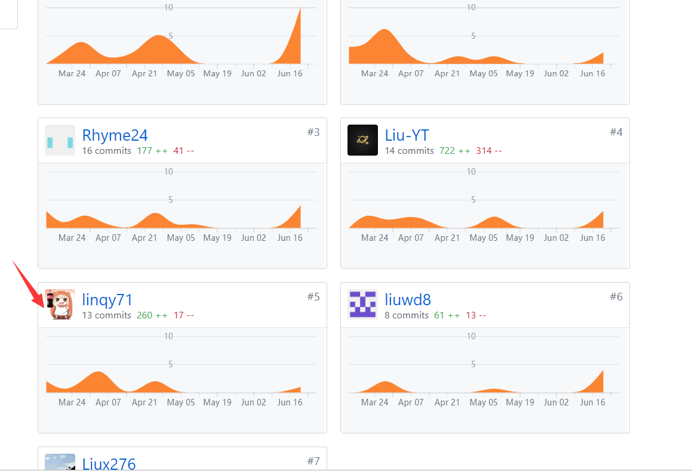

## 1. 个人小结

首先，作为团队的项目经理和前端成员，我帮助团队完成了写文档、画图、确定需求、管理团队、前端代码编写等工作。

总的来说，我们团队成功实现了项目的基本需求，但是与最初的计划有些许的偏差，这是我作为项目经理的失职。但是尽管我们后期有点懈怠了，我们还是在中期完成了大部分的工作，项目的进度也是持续的，迭代周期一和迭代周期二按时完成，迭代周期三拖了一点时间但也完成了。

下面介绍我的成果

#### 1.管理：
- 集合人员，为成员合理分配角色，让前后端分离。这是大家开会共同讨论的结果: [团队与分工](https://money-hub.github.io/Dashboard/02-team-profile.html)
- 编写迭代周期，监督大家根据迭代周期保证产出。[迭代周期](https://github.com/money-hub/Dashboard/blob/master/iterations.md)

#### 2. 分析：
- 需求分析：包括[设计用例以及绘制活动图](https://money-hub.github.io/Dashboard/06-02-use-cases.html)

#### 3. 开发：
- 实现了小程序端的发布任务和任务详情的界面及功能
- 通过前端调用帮助测试后端API，并为后端提出一些逻辑上的缺陷以及数据库字段的完善意见。

## PSP2.1 统计

| PSP阶段 | 耗时(h) |
| ------- | ------  |
|   **计划**      |    5     |
|   预估任务完成的时间      |    5     |
|   **开发**      |   100      |
|   需求分析      |    10     |
|   生成设计文档      |   10      |
|   设计复审      |     0    |
|   代码规范      |     0    |
|   具体设计      |     10    |
|   具体编码      |     60    |
|   代码复审      |     0    |
|   测试         |     10   |
|     **报告**   |     7    |
|   测试报告     |    0      |
|   计算工作量       |     2     |
|   总结&过程改进计划       |    5      |
|    合计      |    112     |

## 主要工作清单

- 最有苦劳的工作：关于发布任务功能的实现，需要与后端交互，而且整个项目最核心的也是这个任务管理系统，因此它涉及到了各个系统API的调用包括用户管理系统、任务管理系统、交易管理系统等。在实现功能的过程中，发现了后端API涉及的逻辑缺陷、数据库字段缺陷以及一些测试漏掉的功能缺陷等。需要与后端沟通，并等待后端修改，才能进行下一步的测试和编写，耗费的时间最长。

## 个人git总结

#### 1. Dashboard文档

#### 2. 小程序端代码

## 个人博客清单

- [微信小程序--入门与踩坑](https://linqy71.github.io/2019/06/29/wechat-project-summary/)
- [MoneyDodo-项目管理总结](https://linqy71.github.io/2019/06/29/MoneyDodo-project-summary/)

## 特别鸣谢
- 感谢linshk同学前端后端两头跑，承担起了前端后端大部分的衔接工作，而且完成了前端40%的工作，并且以自己的小程序项目经验带动了小程序端工作的顺利进行，没有linshk同学，另外两个前端工程师可能要在泥潭里挣扎很久。
- 感谢liuyh同学作为后端的负责人，积极与前端进行沟通并及时解决存在的问题。
- 感谢liuwd同学独自一人承担起了web前端的所有工作。
- 感谢几次会议进行会议记录的朋友，替PM分担了好多工作。
- 感谢每次会议都不缺席的全体组员。

