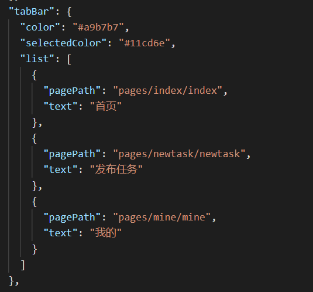
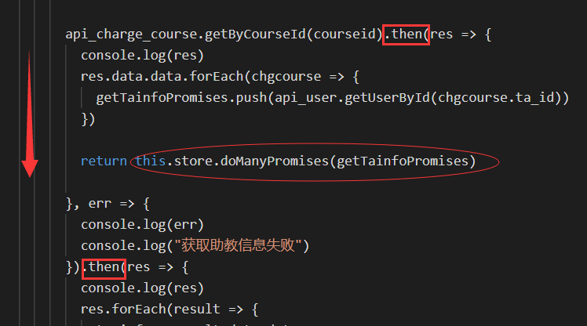

## 微信小程序入门

微信小程序的官方文档提供了非常详细、完整的描述，为入门提供了很好的指导。

- [微信小程序指南](https://developers.weixin.qq.com/miniprogram/dev/framework/)
- [微信小程序组件](https://developers.weixin.qq.com/miniprogram/dev/component/)

还有API、框架等文档也在同一个目录下。

### 组件分享

微信小程序的实现与web网页的实现非常像，但是微信更加便捷，因为它提供了很多封装好的组件，下面介绍一些对于初学者来说觉得挺好用的组件。

#### 1. 分页，tabbar：

- 小程序整体的标签页在app.json中设置即可，默认标签位置在页面底部，color设置标签颜色，selectedColor设置被选中标签颜色，list设置标签内容及对应路径：
  

#### 2. 从底部弹起的滚动选择器，picker：

- [官方文档](https://developers.weixin.qq.com/miniprogram/dev/component/picker.html)

- 除了普通选择器和多列选择器，官方还提供了时间、日期、省市区选择器，真的方便又快捷，感恩。

关于这部分就不再赘述，想起来再补充，基本上你需要的控件微信官方都有提供，在文档上一搜就有了。

### 样式分享，强推 WeUI

WeUI是一套同微信原生视觉体验一致的基础样式库,由微信官方设计团队为微信内网页和微信小程序量身设计,令用户的使用感知更加统一。

首先，微信小程序搜索 “WeUI”, 进入之后页面如下：

小程序提供了很多样例，这些样例都是符合[微信小程序设计指南](https://developers.weixin.qq.com/miniprogram/design/)的，简洁又美观，具有微信的特色。这些只是样例，我们可以依照这些样例进行页面设计，同时WeUI也提供了这些样例对应的代码，给我们太提供了很方便的学习案例。

下面介绍使用方法：

- 首先，[去github下载WeUI代码](https://github.com/Tencent/weui-wxss/)
- 在自己的微信小程序项目中引入样式文件，可直接引用dist/style/weui.wxss，或者单独引用dist/style/widget下的组件的wxss
- 若不知道如何使用样式文件，dist/example/下的代码即是WeUI提供的样例的具体实现。

## 一些坑和技巧

微信小程序其实坑很少，项目经历的时间有点长，很多也已经忘记了，这里替一些还有些许印象的坑坑。

#### console.log()

console.log()可以在调试面板中打印日志，反正找bug我基本就靠这个了，根据查看不同位置的输出看与设想的符不符合来找到出错位置，但是有一天，它反过来摆了我一道。

事情是这样的，我在位置1打印了对象A的值，然后改变对象A的值为A'，然后在位置2再次打印对象A，结果位置1打印出来的值居然是改变后的A'，所以我一直以为是位置1之前的代码出了问题，花了很长的事件都没找出来。

事实上，js并不像C语言那样是严格地从上往下执行的。具体js代码的执行顺序可以参考[这篇博客](https://www.jb51.net/article/127025.htm)

#### Promise

##### 如何确保for循环执行完之后再执行某个promise？

- 举个例子：
  

  *(个人理解，欢迎指教)*
  在getByCourseId返回时，then用来处理成功返回值，此时相当于在一个新开的线程里面执行then里面的代码，在单一的线程里面代码是按顺序执行的，所以在用foreach完成对res的处理之后，下一个promise操作才会被执行。之所以采用return是为了防止多层promise嵌套，提高代码可读性。

##### 如何一次执行多个Promise？

- 还是这个例子：
  

  其中，蓝色框是一个promise操作，红色框是将promise操作存放到一个数组里。

- 最重要的步骤是这个：
  

  `Promise.all`可以将多个Promise实例包装成一个新的Promise实例，在等待多个异步操作返回结果后再执行下一步时非常有用。

