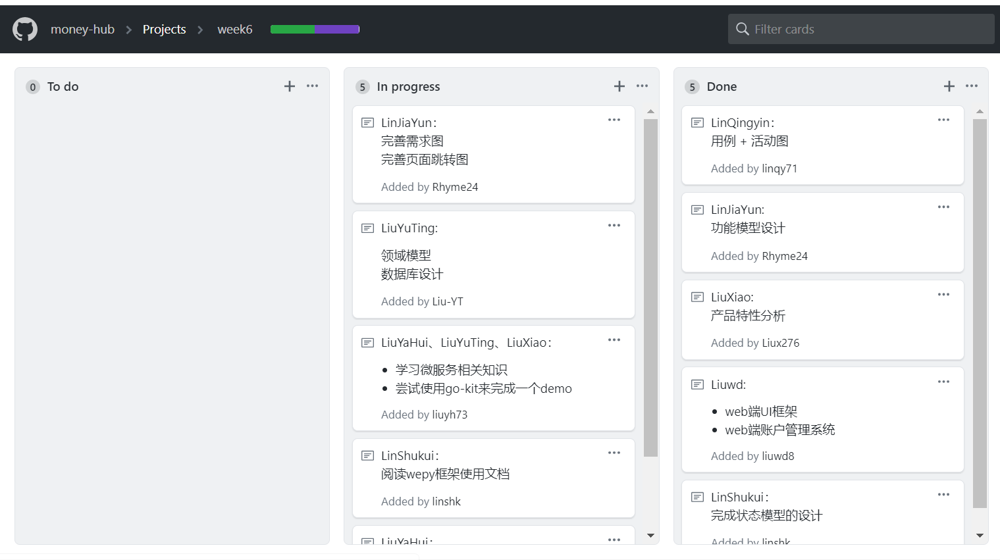
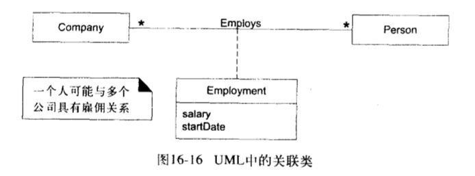
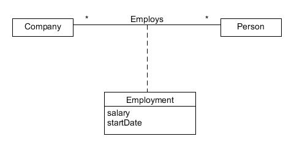

# HW2 

## 简答
### 用简短的语言给出对分析、设计的理解。
- 分析：强调对问题和需求的调查而不是解决方法，例如如果需要一个新的线上交易系统，如何使用它？它的功能是什么？
- 设计：强调满足需求的概念解决方案（在软件和硬件中），而不是它的实现。例如，数据库模式和软件对象的描述。

### 用一句话描述面向对象的分析与设计的优势。
- 能够加强对问题领域和系统责任的理解，对需求的变化由较强的适应性，分析者不需要精通某种程序设计语言，通过共同的标记方法就可以让问题领域的专家与实现领域的专家进行沟通。

### 简述 UML（统一建模语言）的作用。考试考哪些图？
- 统一建模语言(Unified Modeling Language , UML) 是一种绘制软件蓝图的标准语言，可以用UML对软件密集的制品进行可视化、详述、构造和文档化
    1、可视化：清晰的模型有利于交流
    2、详述：可以使用uml对分析、设计、实现等决策进行详细描述
    3、构造：把uml描述映射成编程语言
    4、文档化：系统的所有细节都可以是uml进行描述。如：项目计划、发布活动等
- 用例图、类图、对象图、包图、交互图、状态图、活动图、部署图

### 从软件本质的角度，解释软件范围（需求）控制的可行性
由于软件本身的复杂性、不可见性、一致性、可变性，软件范围多数情况下对于客户和开发者都是模糊的，这形成软件产品与其他产品不同的开发过程。因此，范围管理是软件项目管理的重中之重。在多数情况下，客户与开发者能就项目的 20% 内容给出严格的需求约定，80% 的内容都是相对模糊的。因此，围绕客户目标，发现并满足客户感兴趣的内容是最关键的。砍去一些客户都没思考清晰的业务，永远是对的。

## 实践
### 看板使用练习：

### UML绘图工具练习：
- 取《UML和模式应用(原书第3版)》P211， 图16-17，原图为：
  

- 用UMLet画的图为：
  