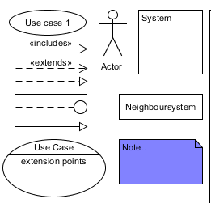
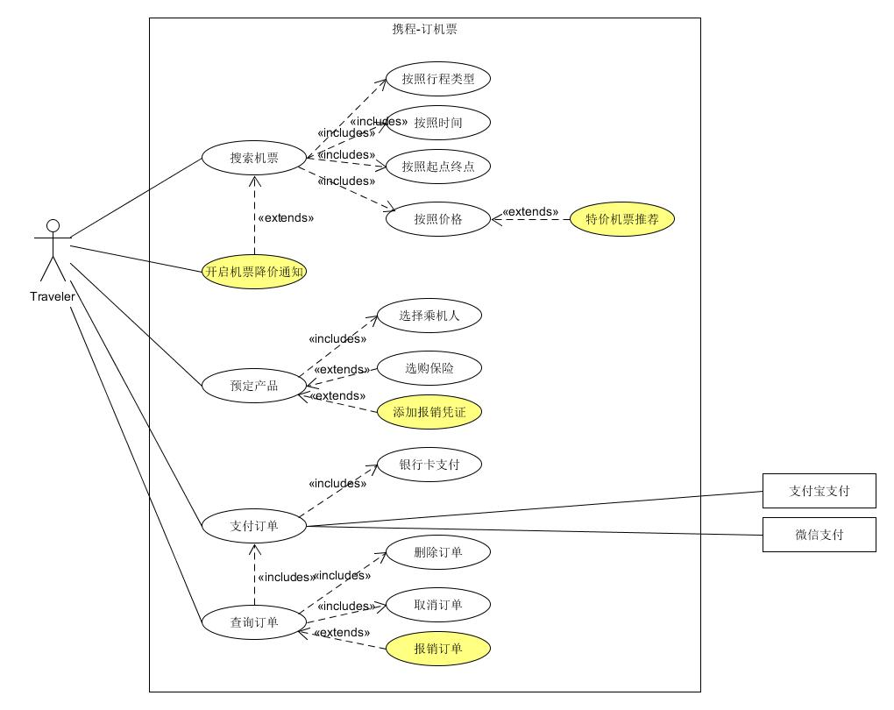

# HW4
## 简答题

1. 用例的概念
   - Use case is a collection of related success and failure scenarios that describe an actor using a system to support a goal.

2. 用例和场景的关系？什么是主场景或 happy path？
   - Scenario is a specific sequence of actions and
interactions between actors and the system; it is also called a use
case instance. A use case represents a collection of scenarios.
   - The primary scenario（主场景／基本流） corresponds to the main system interactions, usually the ‘success’ scenario.

3. 用例有哪些形式？
   - Three Common Use Case Formats : Brief, Casual, Fully

4. 对于复杂业务，为什么编制完整用例非常难？
   - 复杂业务设计的场景较多

5. 什么是用例图？
   - 用例图是指由参与者（Actor）、用例（Use Case），边界以及它们之间的关系构成的用于描述系统功能的视图。

6. 用例图的基本符号与元素？
   - 

   - 用例图包含六个基本元素：参与者(Actor)、用例(Use Case)、关联关系(Association)、包含关系(Include)、扩展关系(Extend)以及泛化关系(Generalization)

7. 用例图的画法与步骤
   - 确定参与者：在获取用例前首先要确定系统的参与者
   - 识别用例：特定参与者希望系统提供什么功能，由哪个参与者触发、当系统改变状态时，是否通知参与者、是否存在影响系统的外部事件等。一般以动词开头描述某件事情。
   - 确定用例间关系：确定用例间的关联关系、包含关系、扩展关系、泛化关系
   - 识别外部系统和服务

8. 用例图给利益相关人与开发者的价值有哪些？
   - 合理的用例识别（制作的用例图），通常给团队带来以下利益：
    - 明确系统的业务范围、服务对象（角色）、外部系统与设备；
    - 帮助识别技术风险，提前实施关键技术原型公关与学习；
    - 易于评估项目工作量，合理规划迭代周期，规划人力需要；
  - 用例图能够让利益相关人更直观地了解到系统所能带来的好处

## 建模练习题（用例模型）

> 选择2-3个你熟悉的类似业务的在线服务系统（或移动 APP），如定旅馆（携程、去哪儿等）、定电影票、背单词APP等，分别绘制它们用例图。并满足以下要求：
> 请使用用户的视角，描述用户目标或系统提供的服务
> 粒度达到子用例级别，并用 include 和 exclude 关联它们
> 请用色彩标注出你认为创新（区别于竞争对手的）用例或子用例
> 尽可能识别外部系统和服务

1. 为什么相似系统的用例图是相似的？
   因为相似的系统要实现的功能是相似的，业务逻辑相似，很多场景也一致，只是针对的对象不同。

2. 如果是定旅馆业务，请对比 Asg_RH 用例图，简述如何利用不同时代、不同地区产品的用例图，展现、突出创新业务和技术.
   可以利用大数据分析，根据用户喜好，用户来自哪里，为用户推荐适合用户风格的酒店。
   
3. 如何利用用例图定位创新思路（业务创新、或技术创新、或商业模式创新）在系统中的作用
   用色彩标注出创新的用例或子用例，从而突出创新思路。
   
4. 请使用 SCRUM 方法，选择一个用例图，编制某定旅馆开发的需求（backlog）开发计划表

| Id | Name | Imp | Est | How to demo | Notes |
| -- | ---- | --- | --- | ----------- | ----- |
| 1 | 查找旅馆 | 25 | 3 | 可按地点、日期查找旅馆 | 调用地图API进行定位 |
| 2 | 下订单 | 20 | 2 | 选择好旅馆、房间类型和日期等信息后确认提交订单 |
| 3 | 支付订单 | 25 | 2 | 选择支付方式进行付款，可使用银行卡支付、微信支付、支付宝支付 | 需要调用外部系统的支付API | 
| 4 | 登录 | 20 | 1 | 人脸识别 | 需要调用相关接口 | 

   
5. 根据任务4，参考 使用用例点估算软件成本，给出项目用例点的估算

| 用例 | # 业务 | # 计算 | 原因 | UC 权重 |
| ---- | ----- | ------ | --- | -------|
| 查找旅馆 | 4 | 3 |  | 简单 |
| 下订单 | 5 | 5 |  | 平均 |
| 支付订单 | 5 | 3 |  | 简单 |
| 登录 | 1 | 1 |  | 简单 |

